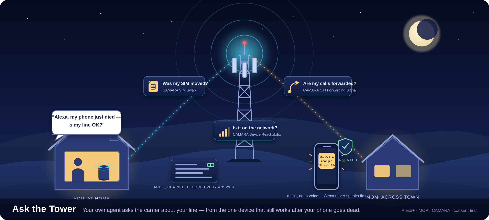
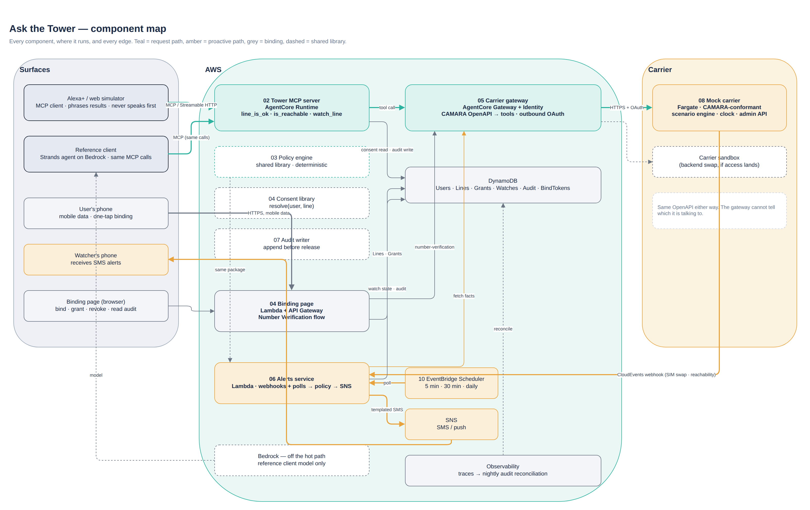

# Ask the Tower



Your own agent on Alexa+ asking the carrier about your line — from the one device that still works after your phone goes dead.

Tower is an MCP server for the **Alexa+ MCP Toolkit**. It asks a carrier three things over standard CAMARA network APIs: was my SIM moved, are my calls being forwarded, and is this phone on the network. It answers only for lines that are bound and consented. Team: Asish Bose and Badhrinath Padmanabhan, Canada. Licence: [Apache-2.0](LICENSE).

> **Status, 2026-10-06.** Verified locally: the compose stack, the tests and a kind cluster; every number below comes from those runs. Not yet done: the AWS deploy, Alexa+ registration, EKS and the video ([Status and limits](#status-and-limits)).

## The problem, in three moments

> **You:** "My phone just lost signal. Alexa, is my line OK?"
> **Alexa:** "Your SIM was moved to another device at 2:14. If that wasn't you, call your carrier now."

> **You:** "Is anything forwarding my calls?"
> **Alexa:** "Yes — all your calls have been forwarding since 7:40 this morning. If you didn't set that, call your carrier."

> **You:** "Is Mom's line OK?"
> **Alexa:** "Yes, as it was. You'll get a text if that changes."

Today the network can answer each of these questions through a standard carrier API. The person whose line it is cannot ask them.

- **971** SIM-swap complaints to the FBI in 2025, with **$17.4 million** in reported losses ([FBI IC3 2025 Internet Crime Report](https://www.ic3.gov/AnnualReport/Reports/2025_IC3Report.pdf), crime-type tables).
- **205** of the 2024 SIM-swap complaints, with **$6.3 million** in losses, came from people aged 60 and over ([FBI IC3 2024 Internet Crime Report](https://www.ic3.gov/AnnualReport/Reports/2024_IC3Report.pdf)).
- **Nearly 3,000** unauthorised SIM swaps were filed to the UK National Fraud Database in 2024, up 1,055 % ([Cifas, 7 May 2025](https://www.cifas.org.uk/newsroom/huge-surge-see-sim-swaps-hit-telco-and-mobile)).

These are reported cases, a floor; US complaints fell from 2023 to 2025 while UK cases rose ([checked 2026-10-06](docs/prior-art.md#numbers)).

## What it does

Tower has three tools:

- `line_is_ok` checks SIM Swap and Call Forwarding Signal.
- `is_reachable` checks Device Reachability Status.
- `watch_line` asks Alerts to text a consented second person when either of `line_is_ok`'s facts changes.

Consent comes first, for your own line too. A line is bound once, with one tap on the phone over mobile data (Number Verification). No carrier call happens unless the line-holder granted that tool to the person asking; grants are revocable and every check is audited. Tower verifies; it does not retrieve. Results are booleans and timestamps: no location, no call or message content, and no history beyond the audit log. Tower is the contracted API consumer, and the person consents.

## Why an Echo

At first a SIM swap feels like bad signal. The phone goes quiet, and the network has already logged the change. The Echo is on home Wi-Fi, so after the phone goes dead it is the one device in the house that can still ask. Alexa+ cannot speak first through an MCP add-on, though. That is why alerts to the second person go by SMS from Tower's backend, and why Mom's Echo only answers when someone asks it.

## See it

- **Video:** not recorded yet. The script is a prompt 16 deliverable (`artifacts/video/script.md`).
- **GIFs:** cut from the video once it exists (moment 1, the phone buzzing, revoke → suppressed).
- **Now:** [demo transcripts](artifacts/transcripts/), the [Alerts log](artifacts/transcripts/alerts-showcase.log), and binding-page screenshots ([bind](artifacts/screenshots/binding-page/1-bind.png), [refused on Wi-Fi](artifacts/screenshots/binding-page/2-refused.png), [audit](artifacts/screenshots/binding-page/5-audit.png)).

## Run it

<!-- Assembled from `make help` (prompt 19's Makefile) and the measured clean-machine run. Re-check after Makefile changes. -->

**Prerequisites:**
- Docker with Compose v2, `make` and `bash`;
- [`uv`](https://docs.astral.sh/uv/) for `make test`. Without uv, `make demo` falls back to the reference-client container.

On Windows, use WSL2 (verified). Git Bash also works once `make` is installed (`winget install ezwinports.make`; not yet verified). Nothing else is needed: `make up` generates the local secrets into a gitignored `deploy/compose/.env`.

The local demo needs no configuration. To use your own secrets, AWS credentials or deploy settings, see [Configuration](#configuration): one file, `.env`.

```bash
git clone <this repo> && cd ask-the-tower
make up          # build and start mock carrier, Tower, binding page, Alerts, DynamoDB Local; wait healthy; seed the demo
make demo        # the three moments + the transplant story via the reference client; prints transcripts
```

Expected output (excerpt from [`artifacts/clean-run.txt`](artifacts/clean-run.txt)):

```
=== Moment 1 — my phone just lost signal ===
  you> My phone just lost signal. Is my line OK?
       → line_is_ok(line=self)  ['SIM_SWAPPED_RECENT']
  ref> Your SIM was moved to another device at 10:12 today. If that wasn't you, call your carrier now.
...
  you> Is Mom's line OK?
       → line_is_ok(line=mom)  ['NO_CONSENT']
  ref> Mom hasn't shared that with you.
demo ok: 4 stories, reason codes as expected
```

Then:

```bash
make showcase    # testing-and-showcase §4, steps 1–9 in order, pausing between them (SHOWCASE_PAUSE=0 to run straight through)
make test        # unit → integration → e2e (the stack is up) → artifacts/test-report.md
make down        # stop and remove everything (containers, volumes, network)
```

<details><summary>Every target (<code>make help</code>)</summary>

<!-- make-help:begin -->
```text
Ask the Tower — make targets  (ENV=local)

General
  config-check         Validate the root .env (the one settings file; template .env.example) and list what is set, secrets masked
  help                 Show this help (grouped), with the current ENV

Stack (local compose)
  up                   Build and start mock, tower, binding, alerts, dynamodb-local; wait healthy; seed demo
  seed                 Reload scenarios/demo.yaml and the demo users/lines/grants (idempotent; runs in a container)
  logs                 Tail local stack logs (Alerts' "SMS to=" lines are the phone buzz)
  logs-save            Write the stack's logs to deploy/compose/logs/stack.log (the privacy grep reads it)
  ps                   Local stack status
  shell-%              Shell into a local service container, e.g. make shell-tower-mcp

Demo and showcase
  demo                 The three moments + transplant story via the reference client; prints transcripts (honours ENV)
  corpus               Tool-selection table from the reference client → artifacts/corpus.md
  policy-table         Print the policy decision table → artifacts/policy-table.md
  showcase-mock        Mock carrier on its own: Swagger UI, clock trick, subscriptions, faults
  showcase-tower       Tower on its own: Inspector, three tools, refusals, latency
  showcase-binding     Binding page on a phone (simulated mobile data locally)
  showcase-gateway     Carrier client: DirectClient locally, Gateway on AWS; backend swap
  showcase-alerts      Proactive path: watch, fire, buzz, revoke, suppressed, escalation
  showcase-audit       Audit: Mom's view, chain verified, tamper detection
  showcase-ref         Reference client: three moments from the terminal, then the corpus
  showcase-ui          Demo control room on the host at 127.0.0.1:8090 (needs make up): Bedrock when credentials resolve, else scripted
  showcase-alexa       Alexa+ simulator script and Tower log tail
  showcase-infra       Clean-machine timing; terraform plan; teardown
  showcase             testing-and-showcase.md §4 steps 1–9 in order against the running stack, pausing (SHOWCASE_PAUSE=0: no pauses)
  showcase-artifacts   Regenerate every generated artefact; fail if any is stale

Tests and checks
  test                 Unit → integration → e2e (ENV; local only when the stack is up) → artifacts/test-report.md with the gates
  test-unit            Pure-code tests, no I/O (starts the coverage data; unit-only coverage → artifacts/coverage-unit.xml)
  test-integration     Component pairs over real interfaces (in-process mock, moto/DynamoDB Local); conformance; privacy; latency
  test-e2e             Full stack against ENV (local|eks|aws): demo vs golden, showcase, alerts, binding, chaos
  test-nightly         Cloud and slow chaos (ENV=aws): Gateway conformance, latency, backend swap, Lambda cold starts
  test-report          junit + coverage (per-path gates) + latency + conformance + privacy → artifacts/test-report.md; fails on a missed gate
  lint                 ruff
  typecheck            mypy --strict on packages
  fmt                  ruff format + fix
  privacy-grep         Grep generated output for phone numbers, health words, keys (+ the privacy-test registry)
  secrets-check        gitleaks over the full git history + grep of artifacts/ and docs/ — pre-submission gate

Images
  build                Build all six images: the five services + demo-ui (tagged with git sha and latest; demo-ui is never pushed)
  build-%              Build one image, e.g. make build-tower-mcp
  push                 Build linux/arm64 (buildx) and push to ECR, tags <git sha> + latest (ENV=eks|aws; `make ecr-up` once first)
  sbom                 SBOM per image → artifacts/sbom/*.json (syft, CycloneDX)
  scan                 CVE scan per image → artifacts/scan/*.txt; fails on critical (grype, else trivy)

AWS (AgentCore)
  ecr-up               Create the five ECR repositories (own state; idempotent; survives `make down`) → artifacts/tf-outputs-ecr.json
  ecr-outputs          Write the ECR root's outputs (repository URLs, registry, region) to artifacts/tf-outputs-ecr.json
  plan                 terraform plan only (main root; needs `make ecr-up`; image_tag = last pushed tag)
  deploy               Check the pushed tag exists; terraform apply; register Gateway specs; seed the mock on Fargate; print outputs
  down                 Local: compose down -v. ENV=aws: destroy the main root — ECR repositories and images are kept (asks unless FORCE=1)
  down-all             After judging: down-eks (if up) + down ENV=aws + destroy the ECR root — the only target that deletes images
  seed-aws             Seed users/lines/grants and the Fargate mock from terraform outputs
  outputs              Print terraform outputs and write deploy/.env.aws
  latency-aws          200 calls per tool against the AgentCore deployment → artifacts/latency-aws.md
  register-gateway     Register the vendored CAMARA specs with AgentCore Gateway; write gateway-tools.json
  tf-check             terraform fmt -check + validate of the main and ecr roots (init -backend=false; never touches AWS) + tables.auto.tfvars.json current

EKS and Helm
  helm-lint            helm lint + helm-unittest + kubeconform (kind and eks values) for every chart and the umbrella
  helm-template        Render the umbrella chart for the current ENV to artifacts/helm-$(ENV).yaml
  helm-kind            kind cluster → load images → install umbrella → run the demo against it
  deploy-eks           EKS module apply → render values → helm upgrade --install → seed Job → print URLs
  down-eks             Uninstall the chart and destroy the EKS module only (asks unless FORCE=1)
  kube-context         Point kubectl at the EKS cluster

Docs and consistency
  diagrams-png         Export docs/architecture/diagrams/*.drawio to png/ (needs drawio CLI)
  docs-check           Every `make x` mentioned in docs/, prompts/, README.md must exist; links resolve
  deck-check           Numbers on the deck vs artifacts/ (docs/submission/deck-consistency.md)
  check-deliverables   Every path named in the prompts' Deliverables blocks exists

ENV=local|eks|aws selects the environment; FORCE=1 skips confirmations; QUIET=1; NO_COLOR=1
```
<!-- make-help:end -->

</details>

**Measured:** 106 s for `make up && make demo` on a clean Docker (Docker-in-Docker, empty image cache, no uv, on the build machine; [`clean-run.txt`](artifacts/clean-run.txt)). A run on separate hardware is still to do. `make help` lists every target.


## Configuration

All settings and secrets live in **one file**: `.env` at the repo root. It is gitignored and never copied into an image. The committed template, [`.env.example`](.env.example), lists every key with a comment.

```bash
cp .env.example .env     # fill in only the lines you need; an empty value means "not set"
make config-check        # validate it and list what is set (secrets and phone numbers masked)
```

| Section of `.env.example` | Keys | Used by | Leave empty and… |
|---|---|---|---|
| AWS credentials | `AWS_PROFILE`, or `AWS_ACCESS_KEY_ID` + `AWS_SECRET_ACCESS_KEY` (+ `AWS_SESSION_TOKEN`); `AWS_REGION` | `make deploy`/`plan`/`push` (`ENV=aws`), `make deploy-eks`, Bedrock for the reference client and `make corpus`, `make latency-aws` | your usual AWS setup (`aws sso login`, `~/.aws`) applies. A profile is preferred over long-lived keys |
| Local stack secrets | `TOWER_BEARER`, `INTERNAL_BEARER`, `TOWER_LINE_ID_KEY`, `TOWER_MSISDN_KEY`, `SESSION_SECRET`, `MOCK_JWT_SECRET` | the compose stack (`make up`) | `make up` generates a random value per machine |
| Local stack behaviour | `BINDING_PUBLIC_URL`, `ALERTS_SENDER`, `SMS_GATEWAY_URL`, `CARRIER_SUPPORT_NUMBER`, `TOWER_TZ` | the compose stack: binding links for a phone on your Wi-Fi, a real phone buzz, spoken time zone | the defaults in `deploy/compose/.env.example` apply |
| Tower inbound identity | `TOWER_JWKS_URL`, `TOWER_JWT_ISSUER`, `TOWER_JWT_AUDIENCE`, `TOWER_JWT_CLIENT_IDS`; `TOWER_JWT` | Alexa+ account linking ([registration runbook](docs/architecture/alexa/registration.md)); `TOWER_JWT` is the bearer host-side tools send to a deployed Tower (`make demo`/`test-e2e`/`latency-aws` with `ENV=aws\|eks`) | local mode uses the static `TOWER_BEARER` only |
| Reference client | `REF_AGENT`, `BEDROCK_MODEL_ID` | `make demo`, `make corpus` | `auto`: Bedrock when AWS credentials resolve, else the scripted agent; Nova Micro |
| Terraform, `ENV=aws` | `TF_VAR_*` for `deploy/terraform` (mock hostname and zone, JWT issuer, SMS sandbox phones, carrier sandbox URLs and secrets) | `make plan`, `make deploy ENV=aws` | `deploy/terraform/envs/aws.tfvars` if you keep one; otherwise Terraform's defaults |
| Terraform, `ENV=eks` | `TF_VAR_*` for `deploy/terraform/eks` (state location of the AWS stack, ingress hosts, certificate) | `make deploy-eks` | `deploy/terraform/eks/envs/eks.tfvars` if you keep one |

**How values reach a run.**

- `mk/vars.mk` loads every non-empty `KEY=value` before anything else and exports it to every recipe. Terraform reads `TF_VAR_*`, and the AWS CLI, boto3, Helm, pytest and the scripts read the rest from the environment.
- `make up` copies the keys compose uses into `deploy/compose/.env`, replacing the generated values. AWS credentials and `TF_VAR_*` are never copied there; the containers get no AWS keys.
- Precedence: `make KEY=value` on the command line beats `.env`, which beats your shell. For Terraform, a value in a `.tfvars` file beats the same `TF_VAR_`.
- Terraform lists use HCL syntax: `TF_VAR_sms_sandbox_numbers=["+1613555xxxx"]`.

**Rules for the file.**

- Write plain `KEY=value`: no quotes and no spaces around `=`.
- Values may not contain `$` or `#`. Make would expand or cut them, so `make` stops and names the line, never the value. Windows line endings are fine.
- `make config-check` fails if `.env` is ever tracked by git, if a value is malformed, or if an AWS key id is set without its secret. It warns about keys that aren't in the template, which are usually typos.
- Running pytest or a script without `make`? Load the file first, then drop the empty keys as `make` does: `set -a; . ./.env; set +a; for k in $(sed -n 's/^\([A-Z0-9_]*\)=$/\1/p' .env); do unset "$k"; done`. An empty `AWS_PROFILE` left exported makes boto3 fail with `ProfileNotFound: ()`.
- Kubernetes secrets on EKS are generated inside the cluster by the Helm chart, not taken from `.env`.

## How it's built

New to the project, or presenting it? Start with the [ten-page explainer](docs/architecture/explainer/README.md): what Tower is, why the Echo, the three moments, both paths, consent, the stack, where it runs, the evidence, and what is real, mock or next, with a talk track per page.



| # | Component | One line |
|---|---|---|
| 1 | [Alexa+ surface](docs/architecture/components/01-alexa-surface.md) | The MCP client. It asks, never speaks first, and phrases results itself. |
| 2 | [Tower MCP server](docs/architecture/components/02-tower-mcp-server.md) | Three tools that return structured results only (FastMCP, Streamable HTTP). |
| 3 | [Policy engine](docs/architecture/components/03-policy-engine.md) | Deterministic. Booleans in, one outcome out; [every decision as a table](artifacts/policy-table.md). |
| 4 | [Consent and binding](docs/architecture/components/04-consent-and-binding.md) | One tap on the phone over mobile data; grants per line per tool; revocable. |
| 5 | [Carrier gateway](docs/architecture/components/05-carrier-gateway.md) | Turns CAMARA OpenAPI into tools, with outbound OAuth. The backend switch is invisible to Tower. |
| 6 | [Alerts](docs/architecture/components/06-alerts-service.md) | Carrier events and polls go through the same policy, and an SMS goes to the consented second person. |
| 7 | [Audit log](docs/architecture/components/07-audit-log.md) | Hash-chained, appended before any answer is released. Answers "who checked my line this week?" |
| 8 | [Mock carrier](docs/architecture/components/08-mock-carrier.md) | CAMARA-conformant, with a scenario engine, clock and admin API. The demo default. |
| 9 | [Reference client](docs/architecture/components/09-reference-client.md) | A Strands agent on Bedrock. It is the test harness, and the demo path if Alexa+ access slips. |
| 10 | [Scheduler and infra](docs/architecture/components/10-scheduler-and-infra.md) | Tables, schedules, keys, Terraform, Helm and the one-command run. |
| 11 | [Demo UI](docs/architecture/components/11-demo-ui.md) | Laptop-only control room: conversation, carrier controls, live SMS and audit feed, bind QR code; runs the `make demo` stories with a pass/fail per step. Never deployed. |

**The three paths** ([`e2e-wiring.md`](docs/architecture/e2e-wiring.md)):

- **Request:** Alexa+ → Tower → consent read → carrier → policy → audit → structured answer. There is no model between the question and the fact.
- **Proactive:** a carrier event or a scheduled poll → the same policy → consent re-checked → SMS. Alexa+ is not on this path.
- **Binding:** a link opened on the phone over mobile data → Number Verification → the line is bound, then a grant is optional.

The request path in detail: [`02-request-path.png`](docs/architecture/diagrams/png/02-request-path.png).

**The seven rules:**

1. Alexa+ phrases; Tower returns structured results. No model is in the request path.
2. Policy is deterministic code. The model never decides whether a call is allowed or what a fact means.
3. Verification, not retrieval: booleans and timestamps only.
4. Consent is per line, per tool, revocable and audited.
5. Alexa+ cannot speak first. Proactive messages are SMS from Alerts.
6. The mock carrier is the demo default. A sandbox is a config swap the gateway cannot see.
7. Binding needs one tap on the phone over mobile data.

## Where it runs

One code base, three environments: local compose, AWS (AgentCore Runtime + Gateway + Identity, Lambda, Fargate) and EKS from Helm. Only configuration differs; the proof is that `make demo ENV=local|eks|aws` produces the same transcripts.

| Environment | Status |
|---|---|
| Local compose | Matches golden, 4/4 ([`clean-run.txt`](artifacts/clean-run.txt)). |
| Kubernetes (kind) | Matches golden, 4/4 ([`helm-kind.txt`](artifacts/helm-kind.txt)). |
| EKS | Not run yet ([`eks-run.txt`](artifacts/eks-run.txt)). |
| AWS | Not deployed yet ([`terraform-plan.txt`](artifacts/terraform-plan.txt)). `terraform validate` passes. |

| Piece | Local compose | AWS | EKS |
|---|---|---|---|
| Tower (MCP server) | container | AgentCore Runtime | Deployment + ALB Ingress |
| Carrier calls | `DirectClient` → mock | AgentCore Gateway + Identity → mock on Fargate | `DirectClient` → mock pod |
| Mock carrier | container | Fargate behind an internal ALB | Deployment |
| Binding page | container | Lambda + API Gateway | Deployment + Ingress |
| Alerts | container, SMS → log | Lambda + EventBridge Scheduler + SNS | Deployment + CronJobs + SNS |
| Store | DynamoDB Local | DynamoDB + KMS | DynamoDB + KMS (IRSA) |

## What's measured

| What | Result | Source |
|---|---|---|
| p95 per tool, in-process | `line_is_ok` 249.9 ms · `is_reachable` 173.3 ms (gate < 400 ms) | [`latency.md`](artifacts/latency.md) — in-process, not representative |
| p95 per tool, local compose | `line_is_ok` 236.7 ms · `is_reachable` 311.7 ms | [`latency-compose.md`](artifacts/latency-compose.md) — one laptop, not AWS |
| p95 per tool, AWS | not measured | [`latency-aws.md`](artifacts/latency-aws.md) |
| CAMARA conformance of the mock | 15 operations, 1,036 generated cases, 0 failing | [`conformance-report.html`](artifacts/conformance-report.html) |
| Tool-selection corpus pass rate | not measured; it needs Bedrock credentials | [`corpus/`](services/ref-client/corpus/) |
| Unit tests | 367 passed, 0 failed, 0 skipped | [`test-report.md`](artifacts/test-report.md) |
| Integration tests | 825 passed, 0 failed, 1 skipped (AWS latency) | [`test-report.md`](artifacts/test-report.md) |
| End to end, ENV=local | 26 passed, 0 failed, 3 skipped (EKS-only) | [`test-report.md`](artifacts/test-report.md) |
| Coverage, unit + integration | `packages/` 94.8 % · `services/` 90.6 % | [`test-report.md`](artifacts/test-report.md) |

## What's real and what's mock

What the tests deliberately do not claim ([testing-and-showcase §5](docs/architecture/testing-and-showcase.md#5-what-the-tests-deliberately-dont-claim)):

- That a real carrier behaves like the mock in timing. The mock is spec-conformant, not latency-realistic; the latency gate is for *our* code.
- That Alexa+ will always pick the right tool. The corpus makes it likely and measurable; MCP makes it the model's call.
- That "reachable" means the phone will ring. Do Not Disturb is invisible to the network; the setup flow says so.

Every network fact in the demo comes from the mock carrier, built to the vendored CAMARA specs ([`specs/camara/`](specs/camara/)) and checked by schemathesis; swapping in a sandbox is one setting. Real Number Verification works because the carrier sees the phone's data session; the mock simulates that with an `X-Mock-Client-Id` header sent by the binding page ([08 §3](docs/architecture/components/08-mock-carrier.md)).

What needs a real carrier is under [Status and limits](#status-and-limits).

## Consent and privacy

What never happens, anywhere ([`e2e-wiring.md` §8](docs/architecture/e2e-wiring.md#8-what-never-happens-anywhere-on-these-paths)):

1. No model decides whether a call is allowed or what a fact means.
2. No subscriber phone number crosses the Alexa+ edge in either direction.
3. No location is requested, returned, or stored.
4. No alert goes to the number that was just swapped.
5. No answer or alert is released before its audit row exists.
6. Alexa+ never speaks unprompted; every proactive message is an SMS or push from Alerts.

How to verify it yourself:
- `make privacy-grep` scans every log, transcript and artefact for phone-number-shaped strings and health words.
- `make showcase-audit` shows Mom's view of her audit chain, has `verify` pass, then tampers with one row and has `verify` name it.
- [`artifacts/policy-table.md`](artifacts/policy-table.md) lists every decision the policy can make.

Lines are keyed by `HMAC-SHA256(number)`; the number is stored only as ciphertext ([SECURITY.md](SECURITY.md)).

## Built with

- Alexa+ MCP Toolkit
- Amazon Bedrock AgentCore Runtime
- Amazon Bedrock AgentCore Gateway
- Amazon Bedrock AgentCore Identity
- Amazon Bedrock + Strands Agents
- Amazon DynamoDB
- Amazon SNS
- Amazon EventBridge Scheduler
- AWS Lambda
- Amazon API Gateway
- AWS Fargate
- Amazon EKS
- AWS KMS
- CAMARA OpenAPI (GSMA Open Gateway)
- FastMCP
- Terraform
- Helm
- Python 3.12

The AWS pieces are written as Terraform and Helm. They pass `terraform validate`, `helm lint` and kubeconform, but have not been deployed yet (see [Status](#status-and-limits)).

## Tracks

- **Alexa+ (primary).** A self-hosted MCP server over Streamable HTTP for the Alexa+ MCP Toolkit, hosted on AgentCore Runtime ([`registration.md`](docs/architecture/alexa/registration.md)).
- **AWS Builder.** The services in [Built with](#built-with), as Terraform ([`deploy/terraform/`](deploy/terraform/README.md)). Bedrock sits in one place, the Strands reference client, off the request path; alert and consent texts are templates.
- **Open Source.** The consent-and-line-binding kit [`packages/tower-consent`](packages/tower-consent/README.md#reuse-with-your-own-camara-client), with install steps and a 20-line example for any CAMARA client. The phone-side flow is in [`services/binding-page`](services/binding-page/README.md#reuse-with-your-own-camara-client).
- **Product feedback.** [`docs/submission/product-feedback.md`](docs/submission/product-feedback.md) and the Alexa+ [friction log](docs/architecture/alexa/friction-log.md).

## Prior art

Most of this exists. Carrier network APIs, MCP servers over them, bank-side SIM-swap checks and carrier SIM locks are all in [`docs/prior-art.md`](docs/prior-art.md), each with a link and a "does / doesn't" note. What is new is a narrow slice:

- A consumer-agent surface for network facts — the person's own assistant asking
- A network fact changing what the assistant is willing to do
- Consent and line binding for lines you don't own

## Status and limits

- **Cut line:** not invoked. AWS and EKS are written and statically checked, not deployed (no AWS credentials in the build); the commands are `TODO(human)` items in the [build log](docs/submission/build-log.md).
- **Alexa+:** not yet registered. The toolkit is US-only and the team is in Canada; the web simulator is the plan and [`registration.md`](docs/architecture/alexa/registration.md) has the fallback. The [friction log](docs/architecture/alexa/friction-log.md) has no live entries yet.
- **Two things need a real carrier:** the one-tap bind over real mobile data, and real subscription event timing.
- **Known limitation, spoken sentences:** the reason codes are right, but the sentence's person is fixed. `line_is_ok(mom)` → OK says "Your line is as it was.", and `is_reachable(self)` → UNREACHABLE says "That person's phone…". It shows in the transcripts. This is an open spec decision ([build log](docs/submission/build-log.md#open-spec-issues-decided-conservatively-needs-a-human)).
- **EKS:** created for the showcase window, then torn down with `make down-eks`; left up it costs about $150 a month.
- **Not yet measured:** AWS latency, the corpus run on Bedrock, and the cost on a real bill.

## Cost

This is an estimate from list prices, not measured; see [`artifacts/cost.md`](artifacts/cost.md).

- **AWS stack as written, running 24/7:** about $45–50 a month. The internal ALB in front of the mock and the WAF make up most of it; AgentCore usage at demo volume is under $1.
- **Showcase window** (deploy, demo, `make down` within 48 h): about $3–4.
- **EKS showcase window:** about $0.21 an hour, so about $5 for 24 h.
- **`make down` / `make down-eks`:** returns the account to zero. The KMS keys wait out a 7-day deletion window.

The deck's "about $12 a month" does not hold for this Terraform always-on; it is close only against a carrier sandbox (no mock, ALB or Fargate). The real figure comes from Cost Explorer after the first deploy.

## Repo map · Licence · Team

```
docs/architecture/   the design: components, wiring, testing, diagrams (png/ exported)
docs/submission/     build log, product feedback, form text
packages/            tower-policy · tower-consent · tower-audit · camara-client
services/            tower-mcp · mock-carrier · binding-page · alerts · ref-client
deploy/              compose · terraform (AWS, EKS) · helm (charts + umbrella)
specs/camara/        vendored CAMARA OpenAPI specs
scenarios/           mock-carrier demo scenarios
artifacts/           generated evidence: tests, latency, conformance, transcripts
prompts/             the build prompts this repo was built from
```

- **Licence:** [Apache-2.0](LICENSE).
- **Contributing:** [CONTRIBUTING.md](CONTRIBUTING.md).
- **Security:** [SECURITY.md](SECURITY.md).
- **Team:** Asish Bose and Badhrinath Padmanabhan, Canada.
