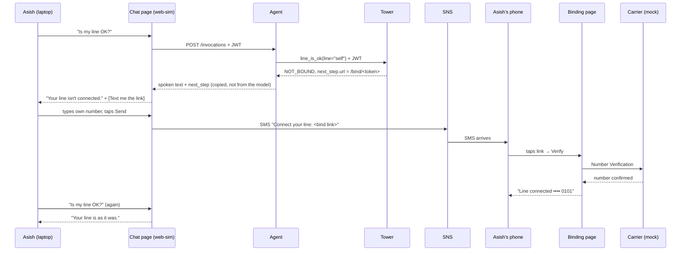
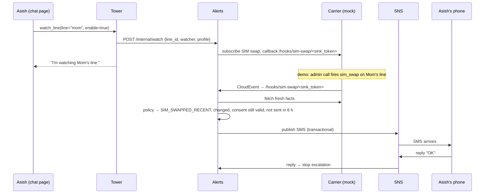

# Bind link and alert SMS — end-to-end flows for the demo

**Status: reviewed 2026-10-09 (Badhri's proposal + team decisions).** Parts marked **exists** are in the code today. Parts marked **exists (prompt 20)** were built by prompt 20 (code and offline tests; the AWS deployment is still `TODO(human)` in build-log/20). They were built as the **web chat page** (`services/web-chat` + the reference client's HTTP app; contract in `components/09-reference-client.md` §6), not by the demo UI (see D-B). The decisions below settle the open questions; anything not listed is roadmap (deadline 23 Oct).

## Decisions (2026-10-09)

| # | Topic | Decision | Why |
|---|---|---|---|
| D-A | Identity | Cognito JWT; `user_id = sub`; Tower verifies via `TOWER_JWKS_URL` | Matches the existing auth decision in `components/01` §4 — no Tower change |
| D-B | Chat page | ~~The chat page **is** the demo UI from `components/11` (Next.js).~~ **Amended 2026-10-09 (prompt 20; build log, Prompt 20, C1):** the chat page is a separate static page, `services/web-chat`, in front of the reference client's HTTP app (09 §6). The demo UI (11) is FastAPI + HTMX, laptop-only and never deployed, and it stays unchanged. Steps 3 and 5 of the plan are the agent (reference client on AgentCore Runtime) and this page | 11 §1 forbids deploying the demo UI and giving it a second client role; a thin page is smaller than changing it |
| D-C | `next_step` | The agent copies `next_step` from the tool result verbatim; the model never produces a URL. The page shows only URLs under `BINDING_BASE_URL/bind/` | Rule 2 (policy is code) and no phishing-shaped output |
| D-D | Bind link delivery | **Link only.** The page shows the link; the user opens it on the phone (type/copy/AirDrop). No SMS from the chat page | Rule 5: proactive SMS comes only from Alerts; the privacy test counts the places a raw E.164 may appear (mock state, carrier call, Alerts' SNS send) — a fourth sender would break it. If SMS delivery is wanted later it goes through Alerts' internal API |
| D-E | QR code | Skipped | New dependency, no judge value |
| D-F | Mom | Mom has her own Cognito account (`cognito_user.py create mom`); her line and the grant to Asish are **pre-seeded** (§3.2 option A). `make seed-aws` reads the real `sub` values that `cognito_user.py` prints, never the local names `user-mom`/`user-asish` | Lowest effort; the video stays short |
| D-G | Binding on AWS against the mock | New mock env flag `MOCK_ASSUME_MOBILE_DATA=1` (default off, documented as simulation) replaces `?as=` outside `TOWER_ENV=local`. Film the binding step locally if simpler | The mock on Fargate cannot see the phone's network |
| D-H | Binding-page re-entry | `atb_session` lifetime 24 h for the demo. Magic-link re-entry goes on the roadmap slide | Not worth a new flow this week |
| D-I | Two-way SMS | One-way SMS on AWS. The "OK" reply and escalation are shown locally with `LogSender` | An SNS origination number (10DLC / toll-free) takes longer to register than we have. Verify the demo phone in the SNS SMS sandbox now |
| D-J | Phone numbers in git | The real demo number lives only in a local, gitignored scenario override | Personal data never in the repo |

What this changes in the text below: read "web-sim" as the web chat page (09 §6); §2.3 (SMS from the chat page) is **not** built — the fallback at the end of §2.3 is the design; §6 defaults are now the decisions above.

## 0. The point

- A user signs in to the **chat page** (`web-sim`) with Cognito. They ask about their line.
- Tower sees that the line is not connected. It answers `NOT_BOUND` with a **bind link**.
- The chat page sends that link **by SMS** to the user's phone. The user taps it on the phone. The binding page connects the line.
- The user goes back to the chat page and asks again. Now Tower answers.
- Later, if something changes on a watched line, **Alerts** sends an SMS through Amazon SNS.

**Words used below**

| Word | Meaning |
|---|---|
| Cognito | AWS sign-in service. Gives a signed token (JWT) with the user's id, `sub` |
| Bind link | `https://<binding-page>/bind/<token>`. The token is single-use, valid 10 minutes, and names one user |
| Binding | Proving "this phone line is mine". The carrier confirms the number; the user never types it to bind |
| SNS | Amazon Simple Notification Service. It sends the actual SMS |
| Mock carrier | Our fake carrier. It plays the real carrier's role (number check, SIM swap events) |

## 1. The pieces and how each one signs you in

| Piece | Runs on (local / AWS) | Sign-in | Status |
|---|---|---|---|
| Chat page (`services/web-chat`, 09 §6) | compose `:8083` (served by the agent) / S3 + CloudFront | **Cognito** Hosted UI (PKCE) user name + password; locally a sign-in stub | exists (prompt 20) |
| Agent (reference client HTTP app) | compose `:8083` / AgentCore Runtime (HTTP) behind a Lambda URL | Cognito JWT, from the chat page; forwarded to Tower unchanged | exists (prompt 20) |
| Tower | compose / AgentCore Runtime (MCP) | Cognito JWT, from the agent | exists |
| Binding page | compose `:8081` / Lambda | **The bind link token** (no password), then cookie `atb_session` | exists |
| Alerts | compose `:8082` / Lambda | Shared bearer from Tower; carrier events use the sink token | exists |
| Mock carrier | compose / Fargate | — | exists |

The chat page and the binding page are **two different sites**. They do not talk to each other. They agree on who you are because Tower writes your Cognito `sub` into the bind token.

---

## 2. Flow 1 — from "is my line OK?" to "Line connected"

### 2.1 Overview

### 2.2 Step by step

| # | What happens | Where | Status | Check (fails closed) |
|---|---|---|---|---|
| 1 | Asish signs in on the chat page | web-sim → Cognito (PKCE) | exists (prompt 20) | Wrong password → no session |
| 2 | Asish asks "Is my line OK?" | web-sim → agent, `Authorization: Bearer <JWT>` | exists (prompt 20) | No token → 401, no model call |
| 3 | The model picks `line_is_ok(line="self")` | agent → Bedrock | exists (prompt 20) | — |
| 4 | Tower finds no bound line for Asish's `sub`. It creates a bind token for that `sub` and answers `NOT_BOUND` with `next_step = {kind: "bind_line", url: ".../bind/<token>"}` | Tower `next_step.py` | **exists** | Token: single use, 10 min, one user |
| 5 | The agent copies `next_step` from the tool result into its reply, **unchanged** | agent `/invocations` | exists (prompt 20) | Only from the tool result, never from model text |
| 6 | web-sim checks the URL: it must start with `BINDING_BASE_URL/bind/` | web-sim | exists (prompt 20) | Anything else → not shown, not sent |
| 7 | The page shows "Your line isn't connected yet", the link (copyable) and "tap it on your phone, then ask again". No SMS button (D-D) | web-sim | exists (prompt 20) | — |
| 8 | ~~Asish types his phone number in a form field and taps Send~~ | — | **not built (D-D)** | See 2.3 |
| 9 | ~~web-sim sends the SMS~~ — Asish copies or AirDrops the link to his phone | — | **not built (D-D)** | No number field, no `sns:Publish` for the page |
| 10 | Asish opens the link on the phone | phone → binding page `GET /bind/<token>` | **exists** | Token unknown or expired → "expired" page |
| 11 | "Turn Wi-Fi off, tap Verify" → Verify | binding page → carrier authorize URL | **exists** | — |
| 12 | The carrier sees the phone on its mobile network and confirms the number (`phoneNumberShare`) | carrier → binding page `/bind/callback` | **exists** (mock: simulated) | On Wi-Fi → refused |
| 13 | `bind_line`: `line_id = HMAC(number)`, `Lines.msisdn_enc = encrypt(number)`, owner = the `sub` in the token | `tower_consent/bind.py` | **exists** | Token for another user → refused; line owned by someone else → "taken" |
| 14 | The phone shows "Line connected •••• 0101" | binding page | **exists** | Only the last four digits |
| 15 | Asish asks again on the chat page. Tower now finds the line and answers | web-sim → agent → Tower | exists (prompt 20) | — |

### 2.3 Sending the link by SMS — rules (**not built; see D-D**)

**The problem:** before binding, we do not know Asish's number. That is the point of binding. So he must **type it** to receive the SMS.

This is safe because a typed number is **only a delivery address, never proof**. Binding still needs the carrier to confirm the line (step 12). If Asish types someone else's number, that person gets a link they can't use: on their phone the carrier confirms *their* line, and the token belongs to Asish's `sub`.

| Rule | Why |
|---|---|
| The number goes into a plain HTML form field, **never into the chat box** | Phone numbers must never reach the model (no numbers in prompts) |
| web-sim checks the number is valid E.164 (`+` and 8–15 digits) | Fail loudly on bad input |
| The number is used once for the SNS call, then dropped: not stored, not logged | Same privacy rule as everywhere else |
| Maximum 3 link SMS per browser session per hour | Stops SMS flooding and cost |
| web-sim's IAM role gets `sns:Publish` for SMS only | Plan step 6 says "nothing else", so it changes |
| Local: log the SMS, or `SMS_GATEWAY_URL` (an SMS-gateway app on an Android phone), like Alerts' `send_backends.py` | Same three senders: `SnsSender`, `LogSender`, `WebhookSmsSender` |

**Simpler fallback:** show the link only, with no SMS. On camera, AirDrop or copy it to the phone. This needs no new IAM permission and no number field.

### 2.4 How the chat page learns "linked"

The binding page and the chat page do not talk. So the chat page **does not know** when binding is done. Two options:

| Option | How | Cost |
|---|---|---|
| **Ask again** (recommended) | After sending the SMS the page says "Tap the link on your phone, then ask again." The next question gets a real answer | Nothing new |
| "I've connected it" button | The button sends the last question again | A few lines in web-sim |

---

## 3. ⚠️ Mom also needs a Cognito account

> **Mom must have her own Cognito account.** The only way to get a bind link is a `NOT_BOUND` answer from Tower, and Tower only answers a signed-in user. Without an account, Mom can't get a bind link, can't connect her line, and so can't share it with Asish.
>
> Create it with `scripts/cognito_user.py create mom` (plan step 1), next to `create asish`.

### 3.1 Mom's part of the flow

| # | Who | Where | What |
|---|---|---|---|
| 1 | Mom | Chat page, **her own browser profile** | Signs in as `mom`. Asks "Is my line OK?" → `NOT_BOUND` + bind link |
| 2 | Mom | Her phone (or simulated, see 3.2) | Taps the link → Verify → "Line connected •••• 0102" |
| 3 | Asish | Binding page `/me` (his `atb_session` cookie from his own binding) | "Create invite code" → `ABCD-EFGH` (single use) |
| 4 | Asish → Mom | Out of band (says it, texts it) | Gives Mom the code |
| 5 | Mom | Binding page `/grants` (her cookie) | New grant: invite code `ABCD-EFGH`, alias **"mom"**, allow check + watch |
| 6 | Asish | Chat page | "Is Mom's line OK?" → `line_is_ok(line="mom")` → "Mom's line is as it was." |

### 3.2 How to fit Mom into the demo

Only **one real phone** is needed (Asish's). Nobody texts Mom's number in the demo story: after a SIM swap, Alerts never texts the swapped line, and Mom has no backup phone. So Mom's line can stay a fictional number (`+16135550102`).

| Option | What is on camera | Effort |
|---|---|---|
| **A. Pre-seed Mom (recommended)** | Off camera: `cognito_user.py create mom`, then seed Mom's line and the grant to Asish (`make seed` / `make seed-aws`). On camera: only Asish binds and asks about Mom | Lowest; the video stays short |
| B. Show Mom's sign-up briefly | Second browser profile signed in as Mom. She binds with the simulated phone (`?as=phone-mom`, local only) and grants by invite code | ~45 s more video; local only (see open question 1) |
| C. Two real phones | Mom binds on a second real phone | Needs a second SNS-verified number; adds nothing the judges need |

Mom's Cognito `sub` must match the `user_id` that the seed writes in `Lines` and `Grants`. So the seed must use the `sub` that `cognito_user.py` prints, not the local test name `user-mom`.

---

## 4. Flow 2 — alert: from a SIM swap to an SMS on the phone

### 4.1 Overview

### 4.2 Step by step (all **exists**, except the chat page)

| # | What happens | Where | Check (fails closed) |
|---|---|---|---|
| 1 | Asish: "Watch Mom's line" → `watch_line(line="mom", enable=true)` | chat page → agent → Tower | Asish needs a **watch** grant on "mom" |
| 2 | Tower → Alerts `POST /internal/watch {line_id, watcher_user_id, enable, profile}`. **No phone number**, only `line_id` | `deps.py` `HttpAlerts` → `internal_api.py` | Shared bearer must match; unset → Alerts refuses all |
| 3 | Alerts saves the row in `Watches` (`line_id`, `watcher_user_id`, `profile`) | DynamoDB | — |
| 4 | Alerts creates a **sink token** (32 random letters) and saves `sink#<token> → line_id` in `AlertsState` | `state.py` | — |
| 5 | Alerts decrypts Mom's number from `Lines` and subscribes at the carrier: "send SIM-swap events for this number to `/hooks/sim-swap/<token>`, with `Bearer <token>`" | `subscriptions.py` → Gateway → mock | — |
| 6 | Tower writes the audit row, then answers "I'm watching Mom's line." | Tower | Audit must succeed first |
| 7 | **Demo trigger:** `POST /_admin/lines/+16135550102/events {sim_swap}` on the mock | admin call | — |
| 8 | The mock posts a CloudEvent to `/hooks/sim-swap/<token>` | mock → Alerts `hooks.py` | Token unknown → 200 + log (never 404); bearer must equal the token; duplicate event → dropped |
| 9 | Alerts loads the Watch, fetches fresh facts, runs the same policy as Tower → `SIM_SWAPPED_RECENT` | `evaluate.py` | Carrier down → keep old state. Missing data is never a change |
| 10 | Changed since last time? Mom still shares with Asish? Not already sent in 6 h? | change: `evaluate.py`; consent re-read: `send.py` `deliver()`; 6-h dedupe: `windows.py` `rate_limited` + the `AlertsState` claim | Revoked → `SUPPRESSED_REVOKED`, nothing sent |
| 11 | Audit row written **before** any SMS | `send.py` | — |
| 12 | Recipients: Asish (watcher) at his alert phone = **his bound line**. Not Mom's line (it was just swapped); Mom has no backup phone → only Asish | `send.py` | Never text the swapped number |
| 13 | Text = the same template Tower speaks, SMS form (`templates.py`). No number, no location, no health words | `templates.py` | Privacy test sweeps SMS bodies |
| 14 | Send | `send_backends.py` | See 4.3 |
| 15 | No "OK" reply within 15 min → text the next person on the list | 5-min schedule, `escalation.py` | A reply from a line swapped in the last 24 h is ignored |

### 4.3 How the SMS lands on the phone

| Where | Sender | What it does |
|---|---|---|
| AWS | `SnsSender` | `sns.publish(PhoneNumber=<E.164>, Message=<text>)`, transactional SMS. A spend cap is set in Terraform (`aws_sns_sms_preferences`) |
| Local | `LogSender` | Writes the text to the log (number shown as a role, e.g. `chain:user-asish`) |
| Local + real phone | `WebhookSmsSender` | Log, plus `POST SMS_GATEWAY_URL {"to", "body"}` to an SMS-gateway app on an Android phone |

Replies ("OK") come back through the SNS topic `replies` → Alerts. Two-way SMS needs an SNS origination number; check this for the demo account.

---

## 5. Demo setup — what is real, what is simulated

| Item | Demo | How |
|---|---|---|
| Carrier data and events | Simulated | Mock carrier; events fired by admin calls |
| "Carrier sees the phone on mobile data" | Simulated | `X-Mock-Client-Id: phone-asish` (local, via `?as=`); on AWS `MOCK_ASSUME_MOBILE_DATA=1` (08 §3, D-G) |
| Asish's phone number | **Real** | In a **local** scenario file, replace `+16135550101` with your number. **Do not commit it** (personal data in git) |
| Bind-link SMS and alert SMS | **Real on AWS** | SNS. First verify your number in the SNS SMS sandbox; new accounts can only text verified numbers |
| Mom | Simulated | Cognito account + seeded line + grant (section 3.2, option A) |
| Chat page, agent, Tower, consent, policy, audit | Real | Same code as production |

**Demo order (about 2 minutes):** Asish signs in → "Is my line OK?" → bind link by SMS → tap on phone → "Line connected" → ask again → "Is Mom's line OK?" → "Watch Mom's line" → fire SIM swap → **phone buzzes** → Mom revokes → fire again → no SMS, audit shows `SUPPRESSED_REVOKED`.

---

## 6. Open questions — resolved (see Decisions table at the top)

| # | Question | Default if nobody decides |
|---|---|---|
| 1 | Binding on AWS against the mock: the `?as=` simulation is off outside `TOWER_ENV=local` (`mobile_data.py`), so the mock may refuse the browser | **Decided (D-G):** `MOCK_ASSUME_MOBILE_DATA=1` on the AWS mock; film binding locally if simpler |
| 2 | Bind link by SMS (section 2.3) or link only? | **Decided (D-D):** link only |
| 3 | QR code for the link | **Decided (D-E):** skip |
| 4 | Getting back into the binding page after the `atb_session` cookie expires (to revoke or see the audit) | **Decided (D-H):** 24 h cookie for the demo; magic link on the roadmap |
| 5 | Two-way SMS replies on AWS need an origination number | **Decided (D-I):** one-way on AWS; reply + escalation shown locally |
